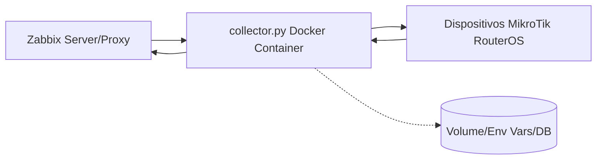

# Projeto Sentinel

## Sistema de Monitoramento Centralizado MikroTik-Zabbix

O Sentinel é um sistema de monitoramento centralizado que integra dispositivos MikroTik com o Zabbix, permitindo monitorar a conectividade de rede de forma eficiente e escalável. Ele atua como um gateway de monitoramento, onde o Zabbix define o que monitorar, qual MikroTik deve realizar os testes e para quais IPs alvo.

### Principais Características

- **Centralização**: Elimina a necessidade de scripts locais nos dispositivos MikroTik
- **Flexibilidade**: Suporta diferentes tipos de testes (ping, TCP connect, traceroute)
- **Escalabilidade**: Arquitetura que permite fácil expansão horizontal
- **Segurança**: Comunicação segura entre componentes
- **Dashboard Web**: Interface gráfica para visualização e execução manual de testes
- **Configuração Avançada**: Sistema robusto com fallback e suporte a criptografia
- **Cache de Resultados**: Otimização de performance para testes frequentes

### Arquitetura

O Sentinel utiliza uma arquitetura onde o `collector.py` atua como componente central:

### Pré-requisitos

- Python 3.9+
- Docker e Docker Compose
- Zabbix 5.0+
- Dispositivos MikroTik com API/SSH habilitado

### Documentação

A documentação completa está disponível no diretório `docs/`:

- [Guia de Instalação](docs/guides/installation.md)
- [Arquitetura do Sistema](docs/architecture/system_architecture.md)
- [Guia de Configuração do Zabbix](docs/guides/zabbix_configuration.md)
- [Guia do Usuário](docs/guides/user_guide.md)
- [Troubleshooting](docs/guides/troubleshooting.md)

### Desenvolvimento

Para contribuir com o desenvolvimento, consulte:

- [Guia de Desenvolvimento](docs/development/development_guide.md)
- [Guia de Contribuição](docs/development/contribution_guide.md)

### Licença

Este projeto é licenciado sob [MIT License](LICENSE).
