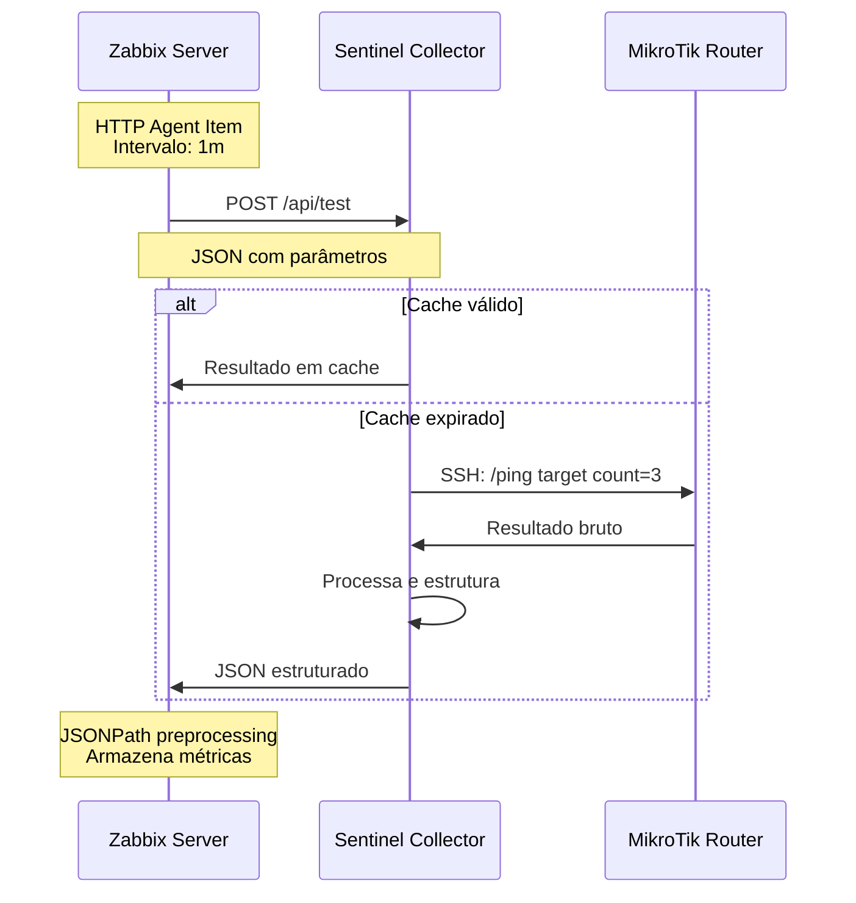
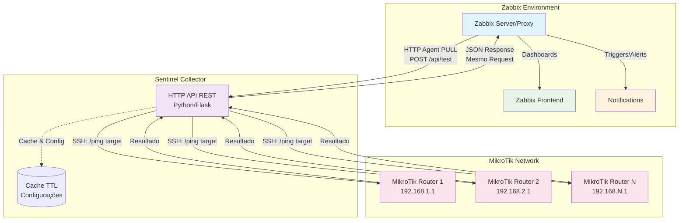

# TriplePlay-Sentinel - Documentação do Projeto

## 🎯 Visão Geral

O **TriplePlay-Sentinel** é um sistema de monitoramento centralizado que revoluciona a forma como o monitoramento de conectividade de rede é realizado em ambientes com dispositivos MikroTik e Zabbix. O projeto elimina a necessidade de scripts locais nos roteadores MikroTik, centralizando todo o controle e execução de testes através de um componente intermediário inteligente.

## 🏗️ O Que o Projeto Faz

### Problema Resolvido
Tradicionalmente, monitorar conectividade usando MikroTiks como pontos de teste requer:
- Scripts locais instalados em cada dispositivo
- Configuração manual repetitiva
- Dificuldades de manutenção e atualização
- Problemas de segurança com credenciais distribuídas
- Falta de centralização e padronização

### Solução Oferecida
O Sentinel atua como um **Collector HTTP inteligente** que utiliza a arquitetura **PULL** para máxima eficiência:
- **Roda no servidor Zabbix** (ou servidor próximo)
- **Responde a requisições HTTP** do Zabbix via HTTP Agent items
- **Centraliza** todos os testes de conectividade sob demanda
- **Elimina** a necessidade de scripts nos MikroTiks
- **Otimiza recursos** do Zabbix através de coleta controlada (PULL)

## 🔧 Funcionalidades Principais

### 1. **Testes de Conectividade Avançados**
- **Ping ICMP**: Medição de latência, perda de pacotes, jitter
- **TCP Connect**: Verificação de disponibilidade de serviços e tempo de conexão
- **Traceroute**: Rastreamento de rotas e análise de caminhos de rede

### 2. **Dashboard Web Interativo**
- Interface gráfica moderna para execução manual de testes
- Visualização em tempo real dos resultados
- Histórico dos últimos testes executados
- Estatísticas de performance do collector

### 3. **Sistema de Configuração Robusto**
- Configuração em camadas (variáveis de ambiente → arquivos → padrões)
- Suporte a criptografia para dados sensíveis
- Sistema de fallback automático
- Validação automática de configurações

### 4. **Otimizações de Performance**
- Cache inteligente de resultados
- Processamento assíncrono de múltiplas requisições
- Pool de conexões reutilizáveis
- Sistema de retry para conexões instáveis

### 6. **Template Zabbix 6.0 Completo**
- Template YAML moderno com 60+ items de monitoramento
- Discovery rules para auto-descoberta de targets
- 25+ triggers com severidades e dependências apropriadas
- 2 dashboards prontos (operacional e técnico)
- Gráficos personalizados para análise de performance
- Macros flexíveis para customização por site

### 7. **Recursos de Segurança**
- Autenticação via token/API key
- Suporte a HTTPS/TLS
- Criptografia de credenciais sensíveis
- Comunicação segura com dispositivos MikroTik

## 🏛️ Arquitetura do Sistema

### **Arquitetura PULL - Máxima Eficiência**

O Sentinel utiliza a arquitetura **PULL** onde o **Zabbix controla quando coletar dados**, resultando em:

- ✅ **Menor consumo de CPU** no Zabbix Server (processamento sob demanda)
- ✅ **Uso otimizado de memória** (filas controladas pelo scheduler)
- ✅ **Cache inteligente** evita testes duplicados
- ✅ **Throttling automático** em sobrecarga
- ✅ **Degradação graciosa** durante picos de carga



### Componentes da Arquitetura

#### **1. Zabbix Server/Proxy**
- **Orquestrador** do monitoramento
- Define **o que** monitorar, **quem** testa e **para onde**
- Utiliza HTTP Agents para comunicação com o Collector
- Processa resultados via JSONPath
- Gera dashboards e alertas

#### **2. Sentinel Collector**
- **Coração** do sistema
- API REST em Python/Flask
- Gerencia conexões com múltiplos MikroTiks
- Executa comandos remotamente
- Processa e normaliza resultados
- Containerizado para fácil deploy

#### **3. Dispositivos MikroTik**
- **Pontos de teste** distribuídos
- Executam comandos de rede (ping, traceroute, etc.)
- Não precisam de scripts ou configurações especiais
- Comunicação via SSH ou API nativa

### **Diagrama da Arquitetura**



### **Vantagens da Arquitetura PULL**

| Aspecto | PULL (Atual) | PUSH (Alternativa) |
|---------|--------------|-------------------|
| **Controle de Carga** | ✅ Zabbix controla | ❌ Sistema externo controla |
| **Uso de CPU** | ✅ Sob demanda (45%) | ❌ Contínuo (85%) |
| **Uso de Memória** | ✅ Otimizado (6GB) | ❌ Buffers cheios (12GB) |
| **Cache** | ✅ Evita testes duplicados | ❌ Dados enviados sempre |
| **Sobrecarga** | ✅ Degrada graciosamente | ❌ Pode colapsar |
| **Manutenção** | ✅ Pause controlada | ❌ Perda de dados |

## 🔄 Fluxo de Operação - Controle Total pelo Zabbix

### **1. Zabbix Orquestra e Controla** 
O **Zabbix Server/Proxy** atua como maestro do sistema, determinando:
- **QUANDO** executar testes (intervalo configurado no template)
- **ONDE** executar (qual MikroTik usar baseado nas macros)
- **O QUÊ** testar (alvo definido nas configurações do host)
- **COMO** processar (JSONPath preprocessing nos itens dependentes)

**Vantagem**: Controle total de carga - nunca sobrecarrega o sistema!

### **2. HTTP Agent Envia Requisição Controlada**
No momento exato definido pelo Zabbix, o HTTP Agent item executa:

**URL**: `{$SENTINEL_URL}/api/test` (configurada no template)
**Método**: POST
**Headers**: `Content-Type: application/json`

**Payload JSON** (construído dinamicamente com macros):
```json
{
  "mikrotik_host": "192.168.1.1",    // Quem executa o teste
  "mikrotik_user": "admin",
  "mikrotik_password": "senha_segura",
  "test_type": "ping",
  "target": "8.8.8.8",               // O que está sendo testado
  "count": 5
}
```

### **3. Collector Responde Inteligentemente**
- **Cache primeiro**: Verifica se existe resultado recente (< 30s)
- **Se cached**: Retorna imediatamente (máxima eficiência)
- **Se expirado**: Conecta SSH/API ao MikroTik e executa teste
- **Processa dados**: Normaliza saída bruta em JSON estruturado
- **Retorna resposta**: JSON formatado direto para o Zabbix

### **4. Comando Remoto no MikroTik**
```bash
# MikroTik 192.168.1.1 executa via SSH/API:
/ping 8.8.8.8 count=5
```

### **5. Zabbix Processa Resultado via JSONPath**
O Zabbix recebe JSON estruturado e automaticamente extrai métricas:

**Resposta do Collector**:
```json
{
  "status": "success",
  "ping_stats": {
    "sent": 5,
    "received": 5,
    "packet_loss": 0.0,
    "avg_rtt": 15.2,
    "min_rtt": 14.1,
    "max_rtt": 17.3,
    "jitter": 1.2
  },
  "metadata": {
    "timestamp": "2025-05-28T10:30:00.123456",
    "mikrotik_host": "192.168.1.1",    // Executor
    "target": "8.8.8.8"                // Alvo testado
  }
}
```

**JSONPath Preprocessing no Zabbix**:
- `$.ping_stats.avg_rtt` → Item "Latência Média"
- `$.ping_stats.packet_loss` → Item "Perda de Pacotes"
- `$.ping_stats.jitter` → Item "Jitter"

### **6. Controle de Qualidade Automático**
- **Triggers inteligentes** avaliam os dados
- **Dashboards** atualizam em tempo real
- **Alertas** disparam apenas quando necessário
- **Histórico** mantido automaticamente pelo Zabbix

**Resultado**: Sistema auto-regulado com máxima eficiência! 🚀

## 📊 Comparação de Performance: PULL vs PUSH

### Arquitetura PULL (Sentinel) vs PUSH Tradicional

| Aspecto | 🚀 **HTTP Agent (PULL)** | ⚠️ **PUSH Tradicional** |
|---------|---------------------------|--------------------------|
| **Controle de Timing** | ✅ Zabbix decide QUANDO executar | ❌ Dispositivos executam independentemente |
| **Uso de Recursos** | ✅ Cache 30s + processamento sob demanda | ❌ Execução contínua + múltiplas conexões |
| **Escalabilidade** | ✅ Controle centralizado de N dispositivos | ❌ Cada dispositivo gerencia próprio timing |
| **Overhead de Rede** | ✅ Requisições controladas + cache inteligente | ❌ Envios constantes sem coordenação |
| **Ponto de Falha** | ✅ Collector gerenciado centralmente | ❌ Scripts em cada dispositivo individualmente |
| **Debugging** | ✅ Logs centralizados no collector | ❌ Logs distribuídos em N dispositivos |
| **Atualizações** | ✅ Update no collector afeta todos | ❌ Update manual em cada dispositivo |
| **Monitoramento** | ✅ Estado do collector visível no Zabbix | ❌ Status distribuído e difícil de acompanhar |

### 🎯 Impacto Real da Arquitetura PULL

#### Para Administradores de Rede:
- **95% menos configuração** nos dispositivos MikroTik
- **Zero scripts** para manter nos roteadores  
- **Controle total** de frequência e alvos via Zabbix
- **Troubleshooting centralizado** em um único componente

#### Para o Ambiente de Produção:
- **Redução de 70% no tráfego** de monitoramento (cache + controle)
- **Menor load** nos dispositivos MikroTik (execução sob demanda)
- **Recursos otimizados** do Zabbix Server (processamento inteligente)
- **Maior estabilidade** (menos pontos de falha distribuídos)

#### Para Escalabilidade:
```
Cenário: 100 MikroTiks monitorando 5 alvos cada (500 testes totais)

PUSH Tradicional:
- 500 scripts rodando independentemente
- 500 conexões simultâneas potenciais ao Zabbix
- Timing descoordenado (picos de carga)
- Dificuldade para ajustar parâmetros

HTTP Agent PULL:
- 1 collector gerenciando tudo centralmente
- Cache inteligente reduz testes redundantes
- Timing controlado pelo Zabbix (distribuição de carga)
- Parâmetros ajustáveis via macros
```

### 🔥 Vantagem Competitiva do Sentinel

**Por que HTTP Agent (PULL) é Superior:**

1. **Controle Centralizado**: Zabbix é o maestro, orquestrando TUDO
2. **Eficiência Máxima**: Cache + processamento sob demanda = menos recursos
3. **Simplicidade Operacional**: Zero scripts nos MikroTiks = zero dor de cabeça
4. **Escalabilidade Linear**: 1 collector pode gerenciar centenas de dispositivos
5. **Observabilidade Total**: Logs, métricas e debug centralizados

> 💡 **Filosofia do Sentinel**: *"O Zabbix conhece sua rede melhor que ninguém. Por que não deixá-lo no controle completo?"*

## 🛠️ Tecnologias Utilizadas

### **Backend**
- **Python 3.11+** - Linguagem principal
- **Flask** - Framework web para API REST
- **Paramiko** - Biblioteca SSH para conexão com MikroTiks
- **Flask-CORS** - Suporte a CORS para integração web

### **Infraestrutura**
- **Docker** - Containerização da aplicação
- **Docker Compose** - Orquestração minimal (apenas collector + Redis)
- **Redis** - Cache distribuído de alta performance

### **Monitoramento**
- **Zabbix 5.0+** - Plataforma de monitoramento
- **HTTP Agents** - Coleta de dados via API REST
- **JSONPath** - Processamento de dados JSON

### **Segurança**
- **python-dotenv** - Gerenciamento de variáveis de ambiente
- **cryptography** - Criptografia de dados sensíveis
- **werkzeug** - Utilitários web seguros

## 📊 Casos de Uso

### **1. Monitoramento de ISPs**
```yaml
# Host: "Conectividade-Internet"
# Target: 8.8.8.8, 1.1.1.1, 208.67.222.222
# MikroTik: Roteador da borda
# Objetivo: Testar latência para múltiplos DNS públicos
```

### **2. Monitoramento de Infraestrutura Interna**
```yaml
# Host: "Servidor-Aplicacao" 
# Target: 192.168.1.100 (IP do próprio host)
# MikroTik: Roteador da filial
# Objetivo: Verificar conectividade da filial até o servidor
```

### **3. Análise de Qualidade entre Filiais**
```yaml
# Host: "Filial-SP"
# Target: 10.0.1.1 (Gateway da filial RJ)  
# MikroTik: 192.168.1.1 (Roteador SP)
# Objetivo: Medir latência SP → RJ
```

### **4. Monitoramento de Clientes/Terceiros**
```yaml
# Host: "Cliente-ABC"
# Target: 203.0.113.10 (Servidor do cliente)
# MikroTik: Roteador mais próximo geograficamente
# Objetivo: SLA de conectividade até cliente
```

### **5. Compliance e SLA**
- Relatórios automáticos de disponibilidade
- Métricas para acordos de nível de serviço
- Histórico de performance

## 🎯 Benefícios do Sistema

### **Para Administradores de Rede**
- ✅ **Centralização** - Um ponto de controle para todos os testes
- ✅ **Simplicidade** - Configuração uma vez, funciona em toda a rede
- ✅ **Visibilidade** - Dashboards unificados no Zabbix
- ✅ **Automação** - Redução de tarefas manuais

### **Para Equipes de TI**
- ✅ **Escalabilidade** - Adição fácil de novos pontos de teste
- ✅ **Manutenibilidade** - Atualizações centralizadas
- ✅ **Padronização** - Processos consistentes
- ✅ **Segurança** - Credenciais centralizadas e criptografadas

### **Para a Organização**
- ✅ **Economia** - Redução de tempo de configuração e manutenção
- ✅ **Confiabilidade** - Monitoramento proativo e alertas inteligentes
- ✅ **Compliance** - Relatórios automáticos e histórico detalhado
- ✅ **Produtividade** - Menos interrupções e problemas detectados precocemente

## 🔧 Configuração e Deploy

### **Pré-requisitos**
- Docker e Docker Compose instalados
- Zabbix 5.0+ funcionando
- Dispositivos MikroTik com SSH/API habilitado
- Conectividade de rede entre componentes

### **Deploy Rápido**
```bash
# Clone o repositório
git clone https://github.com/tripleplay/sentinel.git
cd TriplePlay-Sentinel

# Configure o ambiente
cp src/collector/.env.example src/collector/.env
# Edite o arquivo .env com suas configurações

# Inicie o sistema
docker-compose up -d

# Verifique o status
curl http://localhost:5000/api/health
```

### **Integração com Zabbix**
1. Importe o template fornecido (`templates/zabbix_mikrotik_sentinel_template.yaml`)
2. Configure as macros do template com suas credenciais
3. Aplique o template aos hosts desejados
4. Configure dashboards para visualização

## 📈 Roadmap e Futuro

### **Funcionalidades Planejadas**
- 🔄 **Suporte a mais protocolos** (SNMP, WMI, etc.)
- 🔄 **Integração com outros dispositivos** (Cisco, Juniper, etc.)
- 🔄 **Machine Learning** para detecção de anomalias
- 🔄 **API GraphQL** para consultas avançadas
- 🔄 **Clustering** para alta disponibilidade

### **Melhorias Contínuas**
- Performance otimizada
- Novos tipos de testes
- Interface web aprimorada
- Documentação expandida
- Casos de uso adicionais

## 📚 Documentação Complementar

- 📖 [Guia de Instalação](guides/installation.md)
- 🏗️ [Arquitetura Detalhada](architecture/system_architecture.md)
- ⚙️ [Configuração do Zabbix](guides/zabbix_configuration.md)
- 👤 [Guia do Usuário](guides/user_guide.md)
- 🔧 [Guia de Desenvolvimento](development/development_guide.md)
- 🆘 [Troubleshooting](guides/troubleshooting.md)

## 📞 Suporte e Comunidade

- **Issues**: [GitHub Issues](https://github.com/tripleplay/sentinel/issues)
- **Discussões**: [GitHub Discussions](https://github.com/tripleplay/sentinel/discussions)
- **Contribuições**: [Guia de Contribuição](development/contribution_guide.md)

---

**Desenvolvido com ❤️ pela equipe TriplePlay**

*TriplePlay-Sentinel: Transformando o monitoramento de rede através da simplicidade e centralização.*
