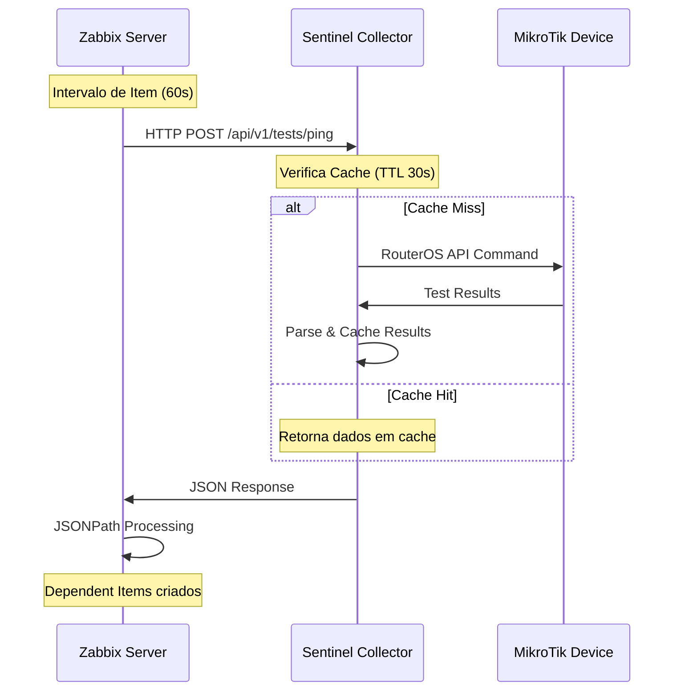

# 🎯 Zabbix HTTP Agent Integration

## Visão Geral

O TriplePlay-Sentinel utiliza a funcionalidade **HTTP Agent** do Zabbix para implementar uma arquitetura PULL eficiente. O Zabbix controla completamente quando, como e quais testes executar, enquanto o Collector responde sob demanda.

## 🏗️ Arquitetura HTTP Agent (PULL)

### Fluxo de Monitoramento


### Vantagens da Arquitetura PULL
- ✅ **Controle Total**: Zabbix determina timing e frequência
- ✅ **Eficiência**: Cache evita testes redundantes
- ✅ **Escalabilidade**: 1 collector, N dispositivos
- ✅ **Simplicidade**: Zero scripts nos MikroTiks
- ✅ **Flexibilidade**: Fácil adição de novos testes

## 📋 Template Zabbix

### Macros Globais
Configure estas macros no template ou host level:

```json
{
  "{$SENTINEL_URL}": "http://your-collector:5000",
  "{$SENTINEL_API_KEY}": "your-secure-api-key",
  "{$MIKROTIK_HOST}": "192.168.1.1",
  "{$MIKROTIK_USER}": "admin",
  "{$MIKROTIK_PASSWORD}": "secure_password",
  "{$TARGET_IP}": "8.8.8.8",
  "{$TARGET_HOST}": "www.google.com",
  "{$TCP_PORT}": "443",
  "{$PING_COUNT}": "4",
  "{$PING_SIZE}": "64",
  "{$TCP_TIMEOUT}": "5",
  "{$TRACEROUTE_HOPS}": "15"
}
```

## 🧪 HTTP Agent Items

### 1. Master Item - Ping Test

#### Configuração do Item
```yaml
Name: "MikroTik Ping Test via Sentinel"
Type: HTTP agent
Key: sentinel.ping.master[{$TARGET_IP}]
URL: {$SENTINEL_URL}/api/v1/tests/ping
Request type: POST
Timeout: 30s
Update interval: 60s

Headers:
  Authorization: Bearer {$SENTINEL_API_KEY}
  Content-Type: application/json

Request body:
{
  "mikrotik_host": "{$MIKROTIK_HOST}",
  "mikrotik_user": "{$MIKROTIK_USER}",
  "mikrotik_password": "{$MIKROTIK_PASSWORD}",
  "target": "{$TARGET_IP}",
  "count": {$PING_COUNT},
  "size": {$PING_SIZE}
}

Value type: Text
Applications: Network Tests
```

#### Dependent Items (JSONPath)

##### Packet Loss
```yaml
Name: "Ping Packet Loss to {$TARGET_IP}"
Type: Dependent item
Master item: sentinel.ping.master[{$TARGET_IP}]
Key: sentinel.ping.loss[{$TARGET_IP}]

Preprocessing:
  1. JSONPath: $.results.packet_loss_percent
  2. Change per second: No

Value type: Numeric (float)
Units: %
Applications: Network Tests
```

##### Average Response Time
```yaml
Name: "Ping Average Time to {$TARGET_IP}"
Type: Dependent item  
Master item: sentinel.ping.master[{$TARGET_IP}]
Key: sentinel.ping.avg[{$TARGET_IP}]

Preprocessing:
  1. JSONPath: $.results.avg_time_ms

Value type: Numeric (float)
Units: ms
Applications: Network Tests
```

##### Jitter
```yaml
Name: "Ping Jitter to {$TARGET_IP}"
Type: Dependent item
Master item: sentinel.ping.master[{$TARGET_IP}]
Key: sentinel.ping.jitter[{$TARGET_IP}]

Preprocessing:
  1. JSONPath: $.results.jitter_ms

Value type: Numeric (float)
Units: ms
Applications: Network Tests
```

##### Status (Success/Failure)
```yaml
Name: "Ping Test Status to {$TARGET_IP}"
Type: Dependent item
Master item: sentinel.ping.master[{$TARGET_IP}]
Key: sentinel.ping.status[{$TARGET_IP}]

Preprocessing:
  1. JSONPath: $.status
  2. JavaScript: |
    if (value === "success") return 1;
    else return 0;

Value type: Numeric (unsigned)
Value mapping:
  0: Failed
  1: Success
Applications: Network Tests
```

### 2. Master Item - TCP Connect Test

#### Configuração do Item
```yaml
Name: "MikroTik TCP Connect Test via Sentinel"
Type: HTTP agent
Key: sentinel.tcp.master[{$TARGET_HOST},{$TCP_PORT}]
URL: {$SENTINEL_URL}/api/v1/tests/tcp
Request type: POST
Timeout: 30s
Update interval: 120s

Headers:
  Authorization: Bearer {$SENTINEL_API_KEY}
  Content-Type: application/json

Request body:
{
  "mikrotik_host": "{$MIKROTIK_HOST}",
  "mikrotik_user": "{$MIKROTIK_USER}",
  "mikrotik_password": "{$MIKROTIK_PASSWORD}",
  "target": "{$TARGET_HOST}",
  "port": {$TCP_PORT},
  "timeout": {$TCP_TIMEOUT}
}

Value type: Text
Applications: Network Tests
```

#### Dependent Items TCP

##### Connection Time
```yaml
Name: "TCP Connect Time to {$TARGET_HOST}:{$TCP_PORT}"
Type: Dependent item
Master item: sentinel.tcp.master[{$TARGET_HOST},{$TCP_PORT}]
Key: sentinel.tcp.time[{$TARGET_HOST},{$TCP_PORT}]

Preprocessing:
  1. JSONPath: $.results.connect_time_ms

Value type: Numeric (float)
Units: ms
Applications: Network Tests
```

##### Connection Status
```yaml
Name: "TCP Connect Status to {$TARGET_HOST}:{$TCP_PORT}"
Type: Dependent item
Master item: sentinel.tcp.master[{$TARGET_HOST},{$TCP_PORT}]
Key: sentinel.tcp.status[{$TARGET_HOST},{$TCP_PORT}]

Preprocessing:
  1. JSONPath: $.results.connection_successful
  2. JavaScript: |
    return value === true ? 1 : 0;

Value type: Numeric (unsigned)
Value mapping:
  0: Failed
  1: Connected
Applications: Network Tests
```

### 3. Master Item - Traceroute Test

```yaml
Name: "MikroTik Traceroute Test via Sentinel"
Type: HTTP agent
Key: sentinel.traceroute.master[{$TARGET_IP}]
URL: {$SENTINEL_URL}/api/v1/tests/traceroute
Request type: POST
Timeout: 60s
Update interval: 300s

Headers:
  Authorization: Bearer {$SENTINEL_API_KEY}
  Content-Type: application/json

Request body:
{
  "mikrotik_host": "{$MIKROTIK_HOST}",
  "mikrotik_user": "{$MIKROTIK_USER}",
  "mikrotik_password": "{$MIKROTIK_PASSWORD}",
  "target": "{$TARGET_IP}",
  "max_hops": {$TRACEROUTE_HOPS}
}

Value type: Text
Applications: Network Tests
```

## 🔔 Triggers Configuration

### Ping Triggers

#### High Packet Loss
```yaml
Name: "High packet loss to {$TARGET_IP}"
Expression: |
  avg(/Template_MikroTik_Sentinel/sentinel.ping.loss[{$TARGET_IP}],5m) > 5

Severity: Warning
Description: |
  Packet loss to {$TARGET_IP} is {ITEM.LASTVALUE}% over the last 5 minutes.
  Threshold: 5%

Recovery expression:
  avg(/Template_MikroTik_Sentinel/sentinel.ping.loss[{$TARGET_IP}],5m) <= 2

Manual close: No
```

#### Complete Connectivity Loss
```yaml
Name: "Complete connectivity loss to {$TARGET_IP}"
Expression: |
  max(/Template_MikroTik_Sentinel/sentinel.ping.loss[{$TARGET_IP}],3m) = 100

Severity: High
Description: |
  Complete connectivity loss to {$TARGET_IP} detected.
  No ping responses received in the last 3 minutes.

Dependencies: None
Manual close: No
```

#### High Latency
```yaml
Name: "High latency to {$TARGET_IP}"
Expression: |
  avg(/Template_MikroTik_Sentinel/sentinel.ping.avg[{$TARGET_IP}],10m) > 100

Severity: Warning
Description: |
  High latency to {$TARGET_IP}: {ITEM.LASTVALUE}ms average over 10 minutes.
  Threshold: 100ms

Recovery expression:
  avg(/Template_MikroTik_Sentinel/sentinel.ping.avg[{$TARGET_IP}],10m) <= 80
```

#### High Jitter
```yaml
Name: "High jitter to {$TARGET_IP}"
Expression: |
  avg(/Template_MikroTik_Sentinel/sentinel.ping.jitter[{$TARGET_IP}],5m) > 20

Severity: Information
Description: |
  High network jitter to {$TARGET_IP}: {ITEM.LASTVALUE}ms
  This may indicate network instability.
```

### TCP Connect Triggers

#### Service Unavailable
```yaml
Name: "Service {$TARGET_HOST}:{$TCP_PORT} unavailable"
Expression: |
  last(/Template_MikroTik_Sentinel/sentinel.tcp.status[{$TARGET_HOST},{$TCP_PORT}]) = 0

Severity: Average
Description: |
  TCP service {$TARGET_HOST}:{$TCP_PORT} is not responding.
  Last check: {ITEM.LASTVALUE}

Manual close: No
```

#### Slow Connection
```yaml
Name: "Slow TCP connection to {$TARGET_HOST}:{$TCP_PORT}"
Expression: |
  avg(/Template_MikroTik_Sentinel/sentinel.tcp.time[{$TARGET_HOST},{$TCP_PORT}],5m) > 1000

Severity: Warning
Description: |
  TCP connection to {$TARGET_HOST}:{$TCP_PORT} is slow: {ITEM.LASTVALUE}ms
  Average over 5 minutes exceeds 1000ms threshold.
```

## 📊 Graphs Configuration

### Ping Performance Graph
```yaml
Name: "Ping Performance to {$TARGET_IP}"
Width: 900
Height: 200
Graph type: Normal

Graph items:
  1. Item: sentinel.ping.avg[{$TARGET_IP}]
     Color: Blue
     Draw type: Line
     Y axis side: Left
     
  2. Item: sentinel.ping.jitter[{$TARGET_IP}]
     Color: Orange  
     Draw type: Line
     Y axis side: Left
     
  3. Item: sentinel.ping.loss[{$TARGET_IP}]
     Color: Red
     Draw type: Line
     Y axis side: Right

Y axis:
  Left: Time (ms)
  Right: Packet Loss (%)
```

### TCP Performance Graph
```yaml
Name: "TCP Connection Performance"
Width: 900
Height: 200

Graph items:
  1. Item: sentinel.tcp.time[{$TARGET_HOST},{$TCP_PORT}]
     Color: Green
     Draw type: Line
     
  2. Item: sentinel.tcp.status[{$TARGET_HOST},{$TCP_PORT}]
     Color: Blue
     Draw type: Line
     Y axis side: Right

Y axis:
  Left: Connection Time (ms)
  Right: Status (0/1)
```

## 🖥️ Dashboard Configuration

### Network Monitoring Dashboard
```yaml
Dashboard: "MikroTik Network Monitoring"
Size: 12x8

Widgets:
  1. Graph Widget (4x2):
     - Graph: "Ping Performance to {$TARGET_IP}"
     - Position: [0,0]
     
  2. Graph Widget (4x2):
     - Graph: "TCP Connection Performance" 
     - Position: [4,0]
     
  3. Plain Text Widget (4x2):
     - Content: |
       Connectivity Status
       Ping Loss: {ITEM.LASTVALUE: sentinel.ping.loss[{$TARGET_IP}]}%
       Avg Latency: {ITEM.LASTVALUE: sentinel.ping.avg[{$TARGET_IP}]}ms
       TCP Status: {ITEM.LASTVALUE: sentinel.tcp.status[{$TARGET_HOST},{$TCP_PORT}]}
     - Position: [8,0]
     
  4. Problems Widget (12x2):
     - Host groups: MikroTik Devices
     - Show suppressed: No
     - Position: [0,2]
```

## ⚙️ Advanced Configuration

### Error Handling no Zabbix

#### Preprocessing para Error Detection
```yaml
# No Master Item - adicionar preprocessing
Preprocessing steps:
  1. Check for error:
     Parameters: "$.status"
     Custom on fail: Set error to "Sentinel API Error: {$.error_message}"
     
  2. Discard unchanged with heartbeat:
     Parameters: 300s
```

#### Item para Monitoring do Collector
```yaml
Name: "Sentinel Collector Health"
Type: HTTP agent
Key: sentinel.health
URL: {$SENTINEL_URL}/api/v1/health
Request type: GET
Timeout: 10s
Update interval: 60s

Headers:
  Authorization: Bearer {$SENTINEL_API_KEY}

Preprocessing:
  1. JSONPath: $.status
  2. JavaScript: |
    return value === "healthy" ? 1 : 0;

Value type: Numeric (unsigned)
Value mapping:
  0: Unhealthy
  1: Healthy
```

### LLD (Low-Level Discovery)

#### Discovery Rule para Múltiplos Targets
```yaml
Name: "Network Targets Discovery"
Type: HTTP agent
Key: sentinel.discovery.targets
URL: {$SENTINEL_URL}/api/v1/discovery/targets
Request type: GET
Update interval: 3600s

Headers:
  Authorization: Bearer {$SENTINEL_API_KEY}

Item prototypes:
  - Name: "Ping to {#TARGET_IP}"
    Key: sentinel.ping.discovered[{#TARGET_IP}]
    Master item: Use discovery rule
    # ... resto da configuração
```

## 🔧 Troubleshooting Zabbix Integration

### Debug Mode
```yaml
# Item de debug - retorna resposta completa
Name: "Sentinel Debug Response"
Type: HTTP agent
Key: sentinel.debug
URL: {$SENTINEL_URL}/api/v1/tests/ping
Request type: POST
# ... configuração normal ...

Value type: Text
Store value: 90 days
Applications: Debug
```

### Log Analysis
```bash
# Zabbix server logs
tail -f /var/log/zabbix/zabbix_server.log | grep -i "http agent"

# Verificar itens com erro
zabbix_server -R config_cache_reload
```

### Performance Monitoring
```yaml
# Monitorar tempo de resposta do Collector
Name: "Sentinel Response Time"
Type: HTTP agent
Key: sentinel.response.time
URL: {$SENTINEL_URL}/api/v1/health
Request type: GET

Preprocessing:
  1. JSONPath: $.response_time_ms
  
Value type: Numeric (float)
Units: ms
```

---

**📝 Nota**: Esta configuração Zabbix é otimizada para arquitetura HTTP Agent (PULL) com cache inteligente, proporcionando monitoramento eficiente e escalável.
