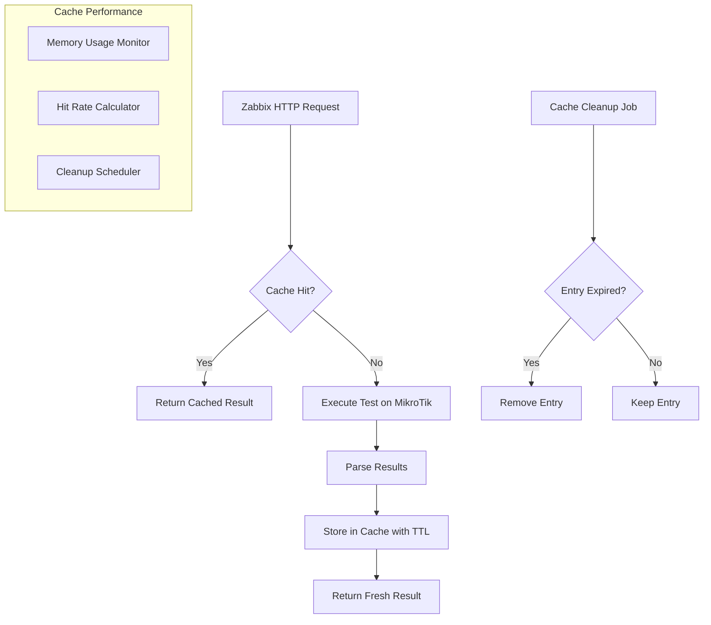

# ⚡ Cache Architecture

## Visão Geral

O sistema de cache do TriplePlay-Sentinel é fundamental para a **eficiência da arquitetura HTTP Agent (PULL)**. Com TTL de 30 segundos, evita execução redundante de testes quando múltiplos items Zabbix fazem requisições simultâneas para o mesmo teste.

## 🏗️ Arquitetura do Cache

### Cache Strategy Flow


### Cache Benefits
- 🚀 **Performance**: Responses em < 1ms para cache hits
- 💾 **Resource Savings**: Evita testes desnecessários no MikroTik
- 📈 **Scalability**: Suporta múltiplos consumers simultâneos
- 🔄 **Freshness**: TTL configurável garante dados atualizados
- 🧠 **Intelligence**: Cache adapta-se automaticamente à carga

## 🔧 Cache Implementation

### Cache Key Strategy
```python
def generate_cache_key(test_type: str, mikrotik_host: str, 
                      target: str, params: Dict) -> str:
    """
    Gera chave única para cache baseada em:
    - Tipo de teste (ping, tcp, traceroute)
    - Host MikroTik origem
    - Target de destino
    - Parâmetros específicos do teste
    """
    
    # Normaliza parâmetros para garantir consistência
    normalized_params = {
        k: str(v).lower() if isinstance(v, str) else v 
        for k, v in sorted(params.items())
    }
    
    # Remove parâmetros que não afetam o resultado
    excluded_params = ['mikrotik_user', 'mikrotik_password', 'timestamp']
    for param in excluded_params:
        normalized_params.pop(param, None)
    
    key_data = {
        'test_type': test_type,
        'mikrotik_host': mikrotik_host,
        'target': target,
        'params': normalized_params
    }
    
    # Hash SHA256 para chave compacta e única
    key_string = json.dumps(key_data, sort_keys=True)
    return hashlib.sha256(key_string.encode()).hexdigest()[:16]

# Exemplos de chaves geradas:
# ping_192.168.1.1_8.8.8.8_a1b2c3d4
# tcp_192.168.1.1_google.com:443_e5f6g7h8
# traceroute_192.168.1.1_8.8.8.8_i9j0k1l2
```

### Cache Storage Structure
```python
class CacheEntry:
    """Estrutura de uma entrada no cache"""
    
    def __init__(self, result: Dict, ttl_seconds: int = 30):
        self.result = result
        self.timestamp = time.time()
        self.ttl_seconds = ttl_seconds
        self.access_count = 0
        self.last_accessed = time.time()
    
    @property
    def is_expired(self) -> bool:
        """Verifica se entrada expirou"""
        return time.time() - self.timestamp > self.ttl_seconds
    
    @property
    def age_seconds(self) -> float:
        """Idade da entrada em segundos"""
        return time.time() - self.timestamp
    
    def access(self) -> Dict:
        """Registra acesso e retorna resultado"""
        self.access_count += 1
        self.last_accessed = time.time()
        return self.result.copy()

class IntelligentCache:
    """Cache inteligente com múltiplas estratégias"""
    
    def __init__(self, default_ttl: int = 30, max_entries: int = 1000):
        self.default_ttl = default_ttl
        self.max_entries = max_entries
        self.cache: Dict[str, CacheEntry] = {}
        self.hit_count = 0
        self.miss_count = 0
        self.cleanup_interval = 300  # 5 minutos
        self.last_cleanup = time.time()
        
        # Lock para thread safety
        self._lock = threading.RLock()
    
    def get(self, key: str) -> Optional[Dict]:
        """Obtém valor do cache"""
        with self._lock:
            if key in self.cache:
                entry = self.cache[key]
                if not entry.is_expired:
                    self.hit_count += 1
                    return entry.access()
                else:
                    # Remove entrada expirada
                    del self.cache[key]
            
            self.miss_count += 1
            return None
    
    def set(self, key: str, value: Dict, ttl: Optional[int] = None):
        """Armazena valor no cache"""
        with self._lock:
            # Cleanup automático se necessário
            self._auto_cleanup()
            
            # Evita overflow de memória
            if len(self.cache) >= self.max_entries:
                self._evict_entries()
            
            cache_ttl = ttl or self.default_ttl
            self.cache[key] = CacheEntry(value, cache_ttl)
    
    def _auto_cleanup(self):
        """Cleanup automático de entradas expiradas"""
        if time.time() - self.last_cleanup > self.cleanup_interval:
            self.cleanup_expired()
    
    def cleanup_expired(self) -> int:
        """Remove entradas expiradas"""
        with self._lock:
            expired_keys = [
                key for key, entry in self.cache.items() 
                if entry.is_expired
            ]
            
            for key in expired_keys:
                del self.cache[key]
            
            self.last_cleanup = time.time()
            return len(expired_keys)
    
    def _evict_entries(self):
        """Remove entradas menos utilizadas (LRU)"""
        # Ordena por último acesso (LRU)
        sorted_entries = sorted(
            self.cache.items(),
            key=lambda x: x[1].last_accessed
        )
        
        # Remove 10% das entradas mais antigas
        evict_count = max(1, len(sorted_entries) // 10)
        for key, _ in sorted_entries[:evict_count]:
            del self.cache[key]
```

## 📊 Cache Performance Metrics

### Key Performance Indicators
```python
class CacheMetrics:
    """Métricas de performance do cache"""
    
    def __init__(self, cache: IntelligentCache):
        self.cache = cache
    
    @property
    def hit_rate(self) -> float:
        """Taxa de acertos do cache (0.0 - 1.0)"""
        total_requests = self.cache.hit_count + self.cache.miss_count
        if total_requests == 0:
            return 0.0
        return self.cache.hit_count / total_requests
    
    @property
    def memory_usage_mb(self) -> float:
        """Uso de memória em MB"""
        import sys
        total_size = 0
        
        for entry in self.cache.cache.values():
            total_size += sys.getsizeof(entry.result)
            total_size += sys.getsizeof(entry)
        
        return total_size / (1024 * 1024)
    
    @property
    def entry_stats(self) -> Dict:
        """Estatísticas das entradas"""
        if not self.cache.cache:
            return {"total": 0, "expired": 0, "active": 0}
        
        total = len(self.cache.cache)
        expired = sum(1 for entry in self.cache.cache.values() if entry.is_expired)
        active = total - expired
        
        return {
            "total": total,
            "expired": expired,
            "active": active,
            "oldest_age_seconds": max(entry.age_seconds for entry in self.cache.cache.values()),
            "avg_access_count": sum(entry.access_count for entry in self.cache.cache.values()) / total
        }
    
    def get_metrics(self) -> Dict:
        """Retorna todas as métricas"""
        return {
            "hit_rate": self.hit_rate,
            "hit_count": self.cache.hit_count,
            "miss_count": self.cache.miss_count,
            "memory_usage_mb": self.memory_usage_mb,
            "entries": self.entry_stats,
            "config": {
                "default_ttl": self.cache.default_ttl,
                "max_entries": self.cache.max_entries,
                "cleanup_interval": self.cache.cleanup_interval
            }
        }
```

### Performance Monitoring Endpoint
```python
from flask import jsonify

@app.route('/api/v1/cache/metrics', methods=['GET'])
@require_auth
def cache_metrics():
    """Endpoint para métricas de cache"""
    
    metrics = cache_manager.get_metrics()
    
    # Adiciona informações de sistema
    metrics['system'] = {
        'timestamp': time.time(),
        'uptime_seconds': time.time() - app.start_time,
        'memory_total_mb': psutil.virtual_memory().total / (1024 * 1024),
        'memory_available_mb': psutil.virtual_memory().available / (1024 * 1024)
    }
    
    return jsonify(metrics)
```

## ⚙️ Cache Configuration

### Environment Variables
```bash
# Cache Configuration
CACHE_DEFAULT_TTL=30              # TTL padrão em segundos
CACHE_MAX_ENTRIES=1000            # Máximo de entradas
CACHE_CLEANUP_INTERVAL=300        # Intervalo de limpeza em segundos
CACHE_MEMORY_LIMIT_MB=100         # Limite de memória em MB

# Performance Tuning
CACHE_HIT_RATE_TARGET=0.80        # Taxa de acerto alvo
CACHE_EVICTION_STRATEGY=lru       # Estratégia de remoção (lru, lfu, fifo)
CACHE_COMPRESSION_ENABLED=true    # Compressão de dados no cache
```

### Dynamic TTL Strategy
```python
class DynamicTTLCache(IntelligentCache):
    """Cache com TTL dinâmico baseado no tipo de teste"""
    
    TTL_MAP = {
        'ping': 30,        # Ping: 30s (frequente)
        'tcp': 60,         # TCP: 60s (médio)
        'traceroute': 300, # Traceroute: 5min (pesado)
        'dns': 120,        # DNS: 2min (moderado)
    }
    
    def get_ttl_for_test(self, test_type: str, target: str) -> int:
        """Calcula TTL baseado no tipo de teste e target"""
        
        base_ttl = self.TTL_MAP.get(test_type, self.default_ttl)
        
        # Ajusta TTL baseado no target
        if self._is_internal_target(target):
            # Targets internos: TTL menor (mais dinâmicos)
            return base_ttl // 2
        elif self._is_critical_target(target):
            # Targets críticos: TTL menor (mais precisão)
            return base_ttl // 3
        else:
            # Targets externos: TTL padrão
            return base_ttl
    
    def _is_internal_target(self, target: str) -> bool:
        """Verifica se target é interno (RFC 1918)"""
        internal_ranges = ['192.168.', '10.', '172.16.', '172.17.', '172.18.']
        return any(target.startswith(range_) for range_ in internal_ranges)
    
    def _is_critical_target(self, target: str) -> bool:
        """Verifica se target é crítico (DNS, gateways, etc)"""
        critical_targets = ['8.8.8.8', '1.1.1.1', 'dns.', 'gateway.']
        return any(critical in target.lower() for critical in critical_targets)
```

## 🔍 Cache Debugging

### Debug Information
```python
def get_cache_debug_info(cache_key: str) -> Dict:
    """Informações detalhadas sobre uma entrada específica"""
    
    entry = cache.cache.get(cache_key)
    if not entry:
        return {"error": "Cache key not found"}
    
    return {
        "key": cache_key,
        "exists": True,
        "expired": entry.is_expired,
        "age_seconds": entry.age_seconds,
        "ttl_seconds": entry.ttl_seconds,
        "remaining_ttl": max(0, entry.ttl_seconds - entry.age_seconds),
        "access_count": entry.access_count,
        "last_accessed": entry.last_accessed,
        "size_bytes": sys.getsizeof(entry.result),
        "result_preview": str(entry.result)[:200] + "..." if len(str(entry.result)) > 200 else str(entry.result)
    }
```

### Cache Health Check
```python
def cache_health_check() -> Dict:
    """Verifica saúde do sistema de cache"""
    
    metrics = cache_manager.get_metrics()
    
    health_status = "healthy"
    issues = []
    
    # Verifica taxa de acertos
    if metrics['hit_rate'] < 0.50:
        health_status = "warning"
        issues.append("Low cache hit rate")
    
    # Verifica uso de memória
    if metrics['memory_usage_mb'] > 80:  # 80MB threshold
        health_status = "warning" 
        issues.append("High memory usage")
    
    # Verifica entradas expiradas
    if metrics['entries']['expired'] > metrics['entries']['total'] * 0.2:
        health_status = "warning"
        issues.append("Too many expired entries")
    
    return {
        "status": health_status,
        "issues": issues,
        "metrics": metrics,
        "recommendations": _get_cache_recommendations(metrics)
    }

def _get_cache_recommendations(metrics: Dict) -> List[str]:
    """Gera recomendações baseadas nas métricas"""
    recommendations = []
    
    if metrics['hit_rate'] < 0.70:
        recommendations.append("Consider increasing TTL values")
        recommendations.append("Review cache key generation strategy")
    
    if metrics['memory_usage_mb'] > 50:
        recommendations.append("Consider reducing max_entries")
        recommendations.append("Enable compression if not already enabled")
    
    if metrics['entries']['expired'] > 100:
        recommendations.append("Reduce cleanup_interval for better performance")
    
    return recommendations
```

## 📈 Cache Optimization Strategies

### Adaptive TTL
```python
class AdaptiveTTLCache(DynamicTTLCache):
    """Cache com TTL adaptativo baseado em padrões de uso"""
    
    def __init__(self, *args, **kwargs):
        super().__init__(*args, **kwargs)
        self.access_patterns = {}  # Histórico de acessos
    
    def adapt_ttl(self, key: str, test_type: str) -> int:
        """Adapta TTL baseado no padrão de acesso"""
        
        pattern = self.access_patterns.get(key, {
            'access_frequency': 1,
            'last_accesses': []
        })
        
        # Calcula frequência de acesso (acessos por minuto)
        recent_accesses = [
            t for t in pattern['last_accesses'] 
            if time.time() - t < 300  # últimos 5 minutos
        ]
        
        frequency = len(recent_accesses) / 5  # acessos por minuto
        
        base_ttl = self.get_ttl_for_test(test_type, '')
        
        if frequency > 2:  # > 2 acessos por minuto
            # Alta frequência: TTL maior para melhor cache hit
            return min(base_ttl * 2, 300)
        elif frequency < 0.2:  # < 1 acesso a cada 5 minutos
            # Baixa frequência: TTL menor para dados mais frescos
            return max(base_ttl // 2, 10)
        else:
            return base_ttl
```

### Predictive Preloading
```python
class PredictiveCache(AdaptiveTTLCache):
    """Cache com preload preditivo"""
    
    def __init__(self, *args, **kwargs):
        super().__init__(*args, **kwargs)
        self.preload_executor = ThreadPoolExecutor(max_workers=2)
    
    def access_with_prediction(self, key: str) -> Optional[Dict]:
        """Acesso com predição de próximos acessos"""
        
        result = self.get(key)
        
        if result:
            # Prediz próximos acessos baseado em padrões
            self._predict_and_preload(key)
        
        return result
    
    def _predict_and_preload(self, accessed_key: str):
        """Prediz e precarrega dados relacionados"""
        
        # Análise simples: se ping foi acessado, preload TCP e traceroute
        if 'ping_' in accessed_key:
            related_keys = self._generate_related_keys(accessed_key)
            
            for related_key in related_keys:
                if related_key not in self.cache:
                    # Agenda preload assíncrono
                    self.preload_executor.submit(self._preload_key, related_key)
    
    def _preload_key(self, key: str):
        """Precarrega uma chave específica"""
        # Implementação do preload baseado na chave
        pass
```

---

**⚡ Performance Target**: Cache hit rate > 80% | Memory usage < 50MB | Response time < 1ms para cache hits
